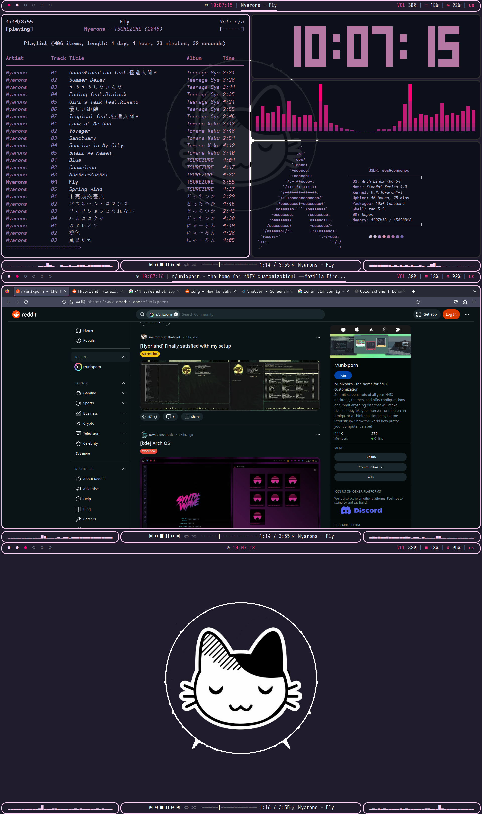

# bspwm-workflow-01
Configuration files for BSPWM
Sorry for my english, tho
# Polybar
To use configuration on specific monitors with high dpi or resolution, edit some parameters on width, height. Because all parameters was strictly wirtten 16:9 widescreen monitor with resolution 1920*1080, with gaps around 10px.

To use audio-visualizers on bottom-bar, you have to install cava with mpd. Additionaly download polybar scripts.
# Preview

